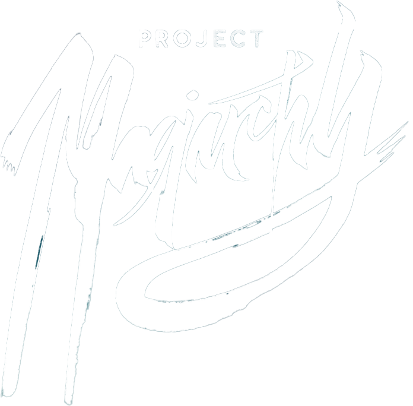

> The story world combines multiple genres and styles into a single unique blend, expressing them individually through its characters and character groups. Each character follows a unique subplot, colliding with the subplots of others. This transforms the story into an 'epic' with an expansive world and a sandbox of unlimited potential to produce new characters and subplots for past, current, and future timelines.

### Narrative Framework
> The project aims to establish a narrative framework comprising fixed rules, guidelines, characters, organisations, relationships, and subplots. This framework will serve as a foundational platform, facilitating the creation of an extensive range of diverse characters and narratives.