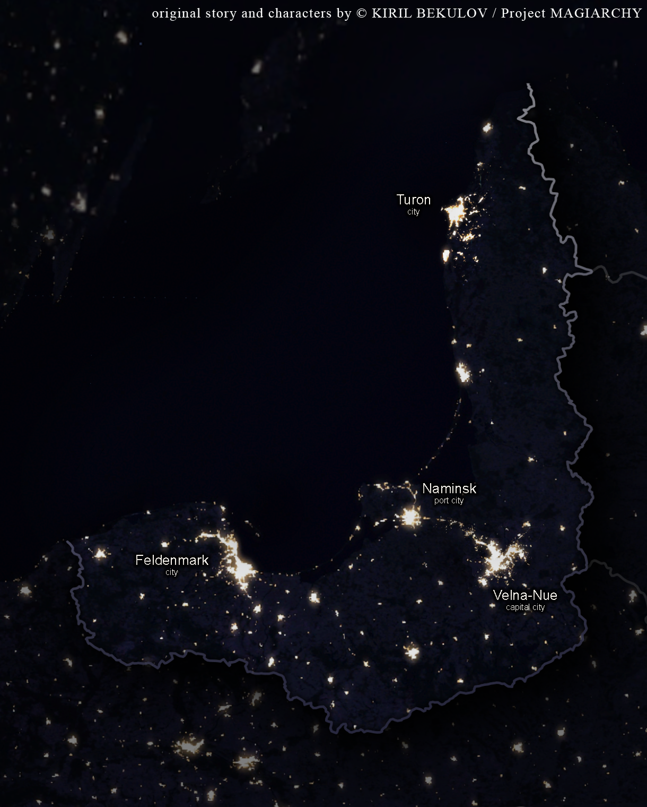

### Lore: The Mage-Church Treaty
- **Treaty Origins:** Long ago, an international agreement was established between mage factions and religious institutions to prevent conflict and maintain secrecy about magic. This treaty, known as the Magiary Accord, governs the delicate balance between the two worlds, with magic being tolerated under strict conditions: it must not interfere with politics, business, or ordinary lives.
- **Church's Role and Methods:** Each religious institution has a covert "cell" comprising a few select members who handle the mage relationship. These cells manage investigations, punish those who violate the treaty, and enforce secrecy. The Church itself does not directly wield magical powers on a wide scale but relies on compliant mages to track, neutralize, or eliminate rogue elements that threaten the balance. Occasionally, it trains select priests to practice thaumaturgy for crises, but such practices are kept minimal and clandestine, aligning with the Church's primary representation of theurgy (internal spiritual transformation).
- **The Symbolic Interplay of Magic and Religion:** In this world, there is no inherent difference between "church magic" and "non-church magic," as all magic is deeply tied to spirituality and religion. Historically, magic originated from the merging of theurgy—the "magic of the soul" or internal transformation—and thaumaturgy—the "magic of the physical world," which involves altering the external environment. The story explores this interplay, where priests embody theurgy, and mages represent thaumaturgy.
- **Mutual Dependence of Theurgy and Thaumaturgy:** The narrative underscores that thaumaturgy cannot function without proper theurgical practice, and vice versa. To change the world around them, mages must first transform themselves through reflection and spiritual growth, highlighting a symbiotic relationship between the two.
- **Compliant vs. Rogue Mages:** Compliant mages align with the Church’s terms, often signaling their allegiance by carrying crosses—anywhere but around their necks—not as symbols of faith, but as marks of cooperation. Despite their utility, they are denied full membership within the Church, reflecting an underlying mistrust. Rogue mages, meanwhile, reject the treaty entirely and are relentlessly hunted by both the Church and their own kind.
- **Tense Partnership:** The treaty exists not from mutual respect but out of pragmatic necessity. The Church lacked the resources to exterminate mage families, and mages lacked the strength to overpower the Church. This uneasy alliance, described as a "cautious partnership," is fraught with mistrust and betrayal, constantly at risk of collapse.
- **Internal Struggles:** The relationship between the Church and the mage community is further complicated by outliers within their ranks who seek to manipulate the treaty for personal or political gain. These actions often lead to additional strain and the need for constant renegotiation.
- **The Setting in the Story:** A pivotal moment tied to this lore appears when Lynleit attends a monastery meeting with her father, Fionn. The event reflects the ongoing negotiations and tensions that underpin the Mage-Church treaty, highlighting Lynleit’s frustration with its complexities and her strained relationship with her stepmother, Helena.

### Lore: The Duchy
The duchy, a small yet storied nation, reflects a unique blend of German, Russian, and Baltic influences, emerging as a sovereign state after the Napoleonic Wars. Governed through a delicate balance of parliamentarian rule and symbolic ducal authority, the country's narrative is shaped by various character groups.

- **MSF (Private Intelligence Agency):** The MSF, initially a grounded private intelligence agency, serves as a tool for Fionn to engage in political manoeuvring. Unbeknownst to its members, it later becomes entangled in magical affairs as Lynleit transforms it into a smaller, focused organization targeting magical threats.
- **The Church:** Concealing a secret faction, the church engages in diplomatic relations with the global mage community, manoeuvring between religious duties and mystical diplomacy.
- **Government Representatives:** Represented by Drake and Sherie, this group embodies the aristocratic layer of the government, striving to maintain order and stability while unaware of the magical undercurrents.
- **Natalia and Lester:** Natalia, a skilled mage, and Lester, her semi-supernatural assistant, operate a private investigative bureau that takes on cases with magical or supernatural elements.
- **Hiyu, Yulia, and Tarek:** This trio of university students finds themselves drawn into the world of the supernatural as they explore a haunted park, uncovering mysteries and facing paranormal threats.
- **Mika:** Natalia's niece, Mika, studies at a hidden university for mages and is drawn into a mysterious investigation when a friend goes missing, leading her to seek Lynleit's help.
Together, these character groups navigate the complexities of a world where the mundane and the mystical intersect, shaping the duchy's fate.

### Lore: On Magic
Magic in this world is an elusive force bestowed by the "mana stream," an inexhaustible source of mystical energy bridging the material and spiritual realms. The mana stream reveals itself to mages through their dreams, transporting them to vivid landscapes reminiscent of Zoroastrian times—vast desert vistas, sacred fire temples, and sprawling ancient cities. Within this dreamscape, the dreamer hears the melodic voice of the "Echo," a hauntingly beautiful song in an ancient tongue, imbued with the wisdom of the long-forgotten Magi. Guided by the Echo’s ethereal melody, mages journey toward the salient points of the mana stream, indicated by flashes of blue flames. The intensity of the flame mirrors a mage's connection to mana, revealing both his potential and ability to wield magic in the real world.

For most mages, the flame remains an ephemeral vision, confined to the dreamscape. Yet, a few rare mage lineages possess the extraordinary gift of manifesting the flame in the real world. This power, both practical and profound, allows Lynleit and a select few others to harness the flame for practical purposes, marking them as singular prodigies in the mage community.